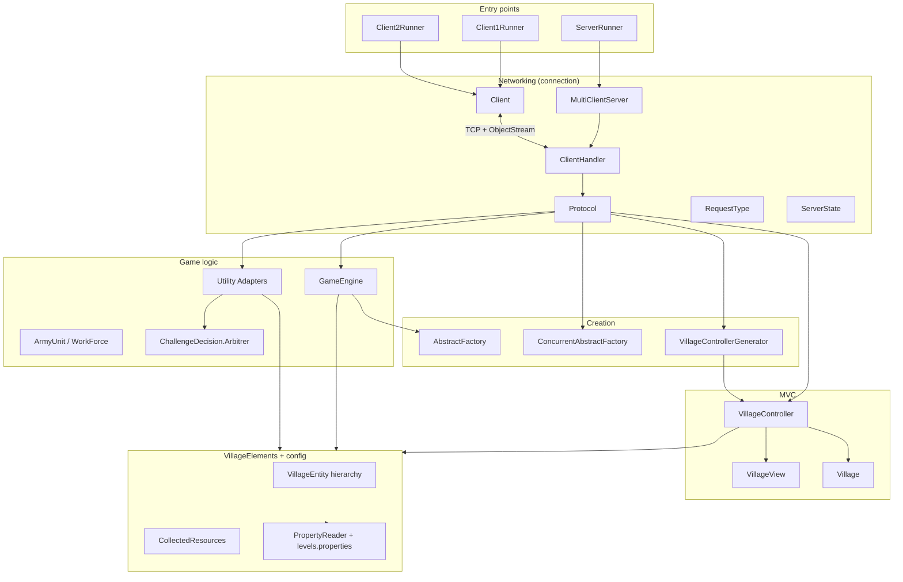
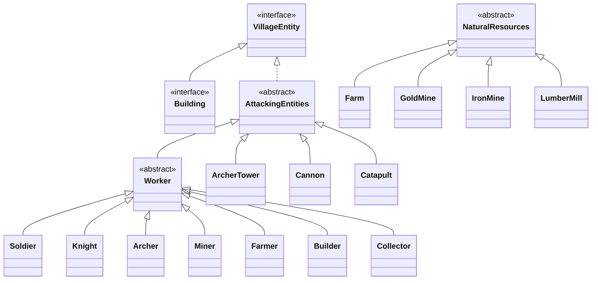

# Architecture

VillageWar is a multithreaded TCP client–server strategy game. The server holds authoritative
per-client game state and resolves all combat; clients are thin console front-ends that issue
typed requests and render responses.

## Layered overview

## Packages

| Package | Responsibility |
|---|---|
| `connection`, `connection.Server`, `connection.Clients`, `connection.protocols` | TCP networking, the request dispatcher (`Protocol`), and the console client. |
| `Controllers`, `Models`, `Views` | MVC triad for a player's village. |
| `Game` | Game logic: random army/village generation, army/workforce aggregates, combat manager. |
| `VillageElements` | Domain entity hierarchy (workers, buildings, defences, resources) + `CollectedResources` value object + classpath config loader. |
| `AbstractFactory` | Abstract Factory for creating entities by type. |
| `ConcurrentAbstractFactory` | Runnable factory variants used by the server for off-thread creation. |
| `Utility` | Adapter layer bridging the domain to the `ChallengeDecision.Arbitrer` combat engine. |
| `ChallengeDecision` | Combat-resolution engine (third-party-style, integrated via adapters). |
| `concurrency` | `VillageControllerGenerator` task. |

## Domain entity hierarchy

Behavior is selected at runtime through marker interfaces: `Recruitable` (joins the army),
`Defender` (defends during combat), and `Peasant` (economy worker).

## Request lifecycle

1. `Client` reads a menu choice and writes a `RequestType` (+ optional payload) to the socket.
2. `ClientHandler` reads the `RequestType` and calls `Protocol.processInput`.
3. `Protocol` mutates `ServerState`, performs the action (often via a factory submitted to its
   executor and awaited with `Future.get()`), and updates the `VillageController`.
4. The server writes the result object (or `null`) back; the client renders it.

## Configuration

Game balance (max counts/levels per town-hall level, per-entity stats) lives in
`src/main/resources/levels.properties` and is loaded once from the classpath and cached by
`PropertyReader`.
