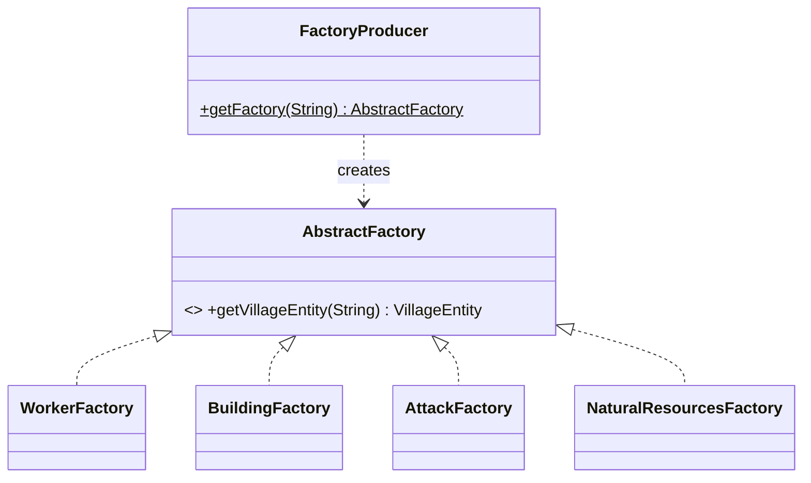
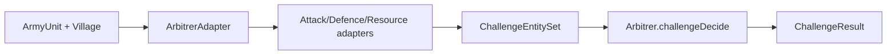

# Design Patterns

VillageWar deliberately demonstrates several Gang-of-Four and architectural patterns.

## Abstract Factory

**Where:** `AbstractFactory` package — `AbstractFactory` interface with `WorkerFactory`,
`BuildingFactory`, `AttackFactory`, `NaturalResourcesFactory`, selected by `FactoryProducer`.

**Intent:** Create families of related `VillageEntity` objects without binding callers to
concrete classes.

Invalid type names raise descriptive checked exceptions (`InvalidWorkerTypeException`,
`InvalidBuildingTypeException`, …), all rooted at `ClassNotFoundException`.

## Adapter

**Where:** `Utility` package. `ArbitrerAdapter` and the per-entity adapters
(`Attack_Entity_To_Challenge_Attack_Adapter`, `Defence_Entity_To_Challenge_Defense_Adapter`,
`Resource_Entity_To_Challenge_Resource_Adapter`) convert domain objects into the data model
expected by the `ChallengeDecision.Arbitrer` engine.

**Intent:** Integrate an externally-provided combat engine without leaking its API into the
domain model — the strongest decoupling demonstration in the project.

## Model–View–Controller

**Where:** `Models.Village` (state), `Views.VillageView` (console rendering),
`Controllers.VillageController` (orchestration). The controller mediates all mutations to the
village and triggers view updates.

## Factory tasks / Runnable workers

**Where:** `ConcurrentAbstractFactory.*` and `concurrency.VillageControllerGenerator` implement
`Runnable` so the server can build entities on its executor and await completion with
`Future.get()`.

## Marker / role interfaces

**Where:** `Recruitable`, `Defender`, `Peasant` in `VillageElements`. These tag entities with
combat/economy roles that drive runtime dispatch in the controller and combat adapters.

## Protocol dispatch (enum-driven)

**Where:** `RequestType` + `ServerState` + `Protocol.processInput`. A typed request enum drives
a server-side dispatch table and a tracked server state, forming a lightweight request/response
protocol over TCP.

## Patterns earmarked for future work

See the roadmap in the README: decomposing the `Protocol` dispatch into the **Command** pattern,
introducing a **Strategy** for combat engines, and an **Observer** for model→view / server→client
updates.
