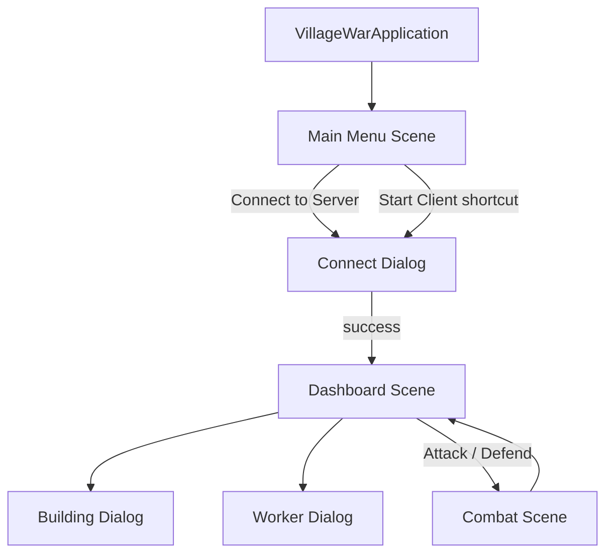

# JavaFX Frontend Architecture

> **Package note:** UI code lives under `com.villagewar.ui` (not `javafx.*`) to avoid
> colliding with OpenJFX's built-in `javafx.util`, `javafx.application`, etc.

## Goals

- Reuse the existing **TCP client** (`connection.Clients.Client`) and server protocol unchanged.
- Preserve the **console client** (`Client1Runner` / `Client.setupClient()`).
- Present village state through a **ViewModel** layer; all mutations go through the network service.

## Package structure

```
src/main/java/com/villagewar/ui/
├── VillageWarApplication.java      # JavaFX Application entry
├── VillageWarLauncher.java         # main() for Maven / IDE launch
├── service/
│   └── GameClientService.java      # Async wrapper around Client (network I/O off UI thread)
├── viewmodel/
│   ├── VillageViewModel.java       # Observable village dashboard state
│   └── CombatResultViewModel.java  # Last battle outcome for the combat screen
├── controller/
│   ├── MainMenuController.java
│   ├── ConnectController.java
│   ├── DashboardController.java
│   ├── BuildingDialogController.java
│   ├── WorkerDialogController.java
│   └── CombatController.java
└── util/
    ├── FxmlLoaderHelper.java
    ├── EntityNodeFactory.java    # Village map nodes (icon + tooltip + level)
    └── UiMessages.java             # Alerts, status bar helpers

src/main/resources/javafx/
├── css/villagewar.css
└── fxml/
    ├── main-menu.fxml
    ├── connect-dialog.fxml
    ├── dashboard.fxml
    ├── building-dialog.fxml
    ├── worker-dialog.fxml
    └── combat.fxml
```

## Scene hierarchy



## Controller ↔ ViewModel ↔ Service

| UI action | Controller | Service (background) | Client API |
|---|---|---|---|
| Connect | `ConnectController` | `GameClientService.connect` | `Client.connect()` |
| Create village | `DashboardController` | `createVillage()` | `RequestType.CREATE_VILLAGE_REQUEST` |
| Refresh | `DashboardController` | `refreshVillage()` | `GET_VILLAGE` |
| Add building | `BuildingDialogController` | `addBuilding(type)` | `CREATE_BUILDING_REQUEST` |
| Add worker | `WorkerDialogController` | `addWorker(type)` | `CREATE_WORKER_REQUEST` |
| Upgrade | `DashboardController` | `upgradeVillage()` | `UPGRADE_VILLAGE` |
| Attack | `CombatController` | `fightRandomVillage()` | `FIGHT_RANDOM_VILLAGE` |
| Defend | `CombatController` | `randomAttackOnVillage()` | `RANDOM_ATTACK_ON_VILLAGE` |

## Threading model

- All socket I/O runs on a **single-thread executor** inside `GameClientService`.
- UI updates only on the JavaFX Application Thread (`Platform.runLater`).
- Loading indicators bound to `GameClientService.busyProperty()`.

## Console coexistence

`Client.setupClient()` is unchanged. Network helpers are **public** and shared by console and JavaFX.
