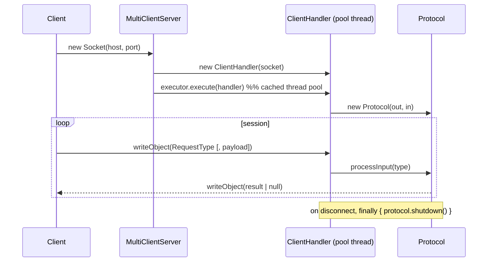

# Networking & Concurrency

## Transport

VillageWar uses **blocking TCP** (`java.net.ServerSocket` / `Socket`). The wire format is Java
object serialization (`ObjectInputStream` / `ObjectOutputStream`), exchanging typed
`RequestType` enums, primitive payloads, and serialized domain objects.

TCP is chosen over UDP because the game requires ordered, reliable, connection-oriented delivery
of state-changing requests.

## Server model

- `MultiClientServer` accepts connections in a loop and dispatches each to a
  `newCachedThreadPool()` — one handler per client enables genuine multi-client concurrency.
- Each `ClientHandler` owns one `Protocol`, which holds that client's authoritative
  `VillageController` (per-connection game state; no shared world).

## Concurrency design

| Concern | Approach |
|---|---|
| Multiple clients | Cached thread pool in `MultiClientServer`; one `ClientHandler` per connection. |
| Off-thread entity creation | `Protocol` submits `Runnable` factory tasks to its executor and awaits them with `Future.get()` (no busy-waiting). |
| Connection counters | `AtomicInteger` (e.g. `ClientHandler` client numbering, `VillageControllerGenerator` ids). |
| Executor lifecycle | `Protocol.shutdown()` is invoked from `ClientHandler`'s `finally` block so per-connection pools are released. |
| Config loading | `PropertyReader` uses double-checked locking to load `levels.properties` once. |

### History / fixes applied

- Replaced three `while(!future.isDone()){}` **busy-wait spin loops** with `Future.get()`.
- Removed **fake concurrency** (`new Thread(this).start(); join();`) from the concurrent
  factories' creation method.
- Replaced non-atomic `static` counters with `AtomicInteger` to eliminate data races.

## Known limitations & roadmap

- Java serialization couples client/server versions and is unsafe for untrusted input; a
  versioned JSON/Protobuf protocol is the planned replacement.
- One blocking thread per connection limits scale; an async/NIO or virtual-thread model is a
  future improvement.
- A single shared application executor should replace per-`Protocol` pools.
